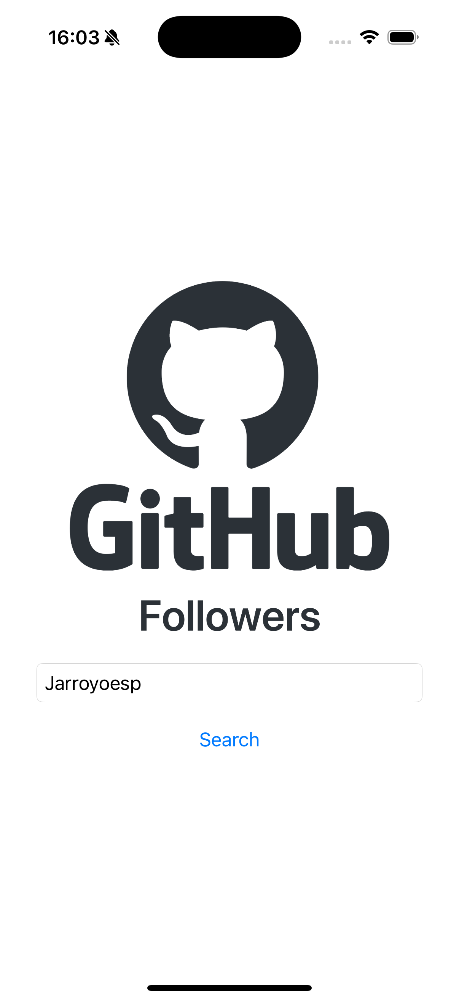
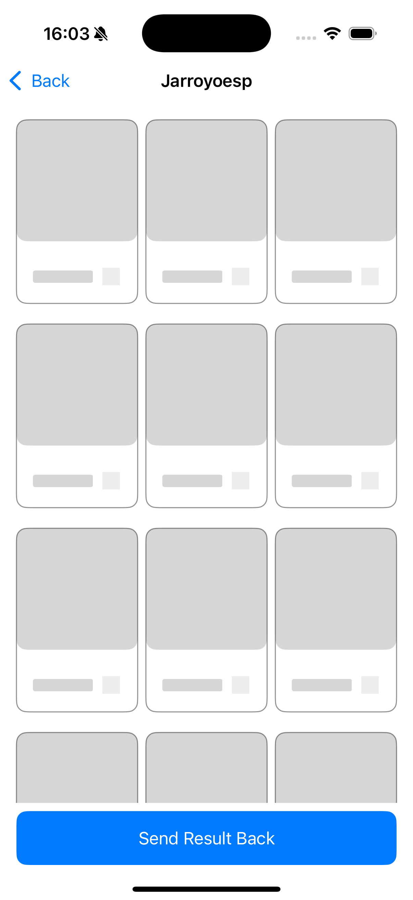
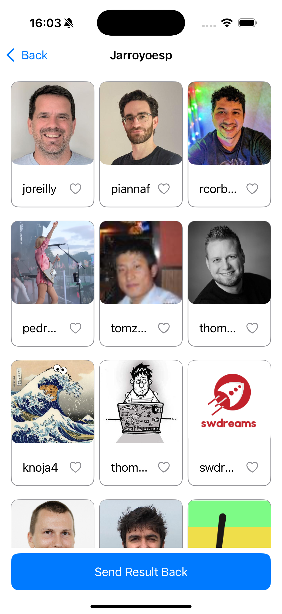
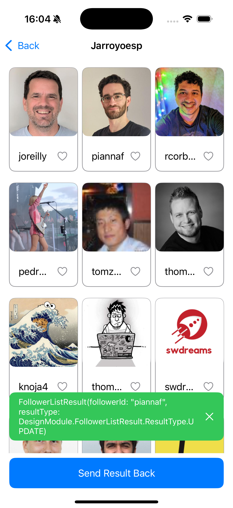

# GitHub Followers App

An example iOS application built with **SwiftUI** that allows users to search for GitHub usernames and explore their list of followers. Users can tap on any follower to navigate to their profile and see their followers as well, enabling seamless navigation between GitHub profiles.

## ✨ Features

- 🔍 Search for GitHub users by username
- 👥 View a paginated list of followers
- 🔗 Navigate between user profiles and their followers
- 📡 Integration with the GitHub REST API
- 🧪 Architecture designed for easy testing and separation of concerns

## 🧱 Architecture

The app follows a lightweight, testable architecture using **ViewModel** classes with clearly separated responsibilities:

### ViewModel Protocols

```swift
public protocol ViewEvent {}
public protocol ViewState {}
public protocol ViewEffect {}

open class BaseViewModel<UiEvent: ViewEvent, UiState: ViewState, UiEffect: ViewEffect>: ObservableObject {
    @Published public var state: UiState
    @Published public var effect: UiEffect?

    public let navigator = Navigator.shared

    public init(initialState: UiState) {
        state = initialState
    }

    open func send(event _: UiEvent) {
        fatalError("Subclasses must implement send(event:)")
    }

    open func onUiEvent(event: UiEvent) {
        send(event: event)
    }

    open func onLoadingChanged(loading _: Bool) {}

    public func load(block: () -> ()) {
        onLoadingChanged(loading: true)
        block()
        onLoadingChanged(loading: false)
    }
}
```
### Base ViewModel

All view models inherit from BaseViewModel, which manages state and effect publishing.

📦 Technologies
	•	Swift 5.9+
	•	SwiftUI
	•	SwiftUI - NavigationStack


|  |  |  |
|-----------------------------------------------|-----------------------------------------------|-----------------------------------------------|
|  |                                               |                                               |
